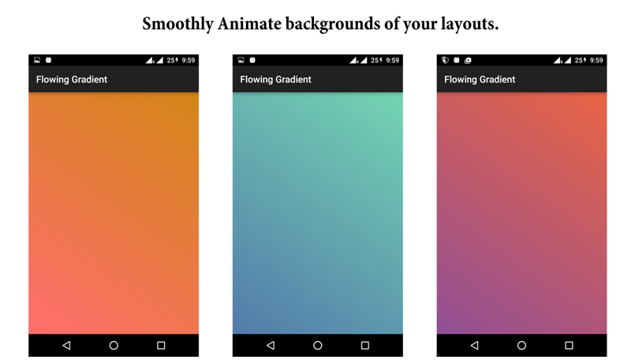

# Flowing Gradient Library
[](https://android-arsenal.com/details/1/3984)
[](https://github.com/dynamitechetan/Flowing-Gradient) Android ver 3.1+

## How to use
Add these lines in your build.gradle files:
##### In your Project Level build.gradle
```gradle
repositories {
        jcenter()
}
```
##### In your App Level build.gradle

```gradle
dependencies {
    compile 'com.dynamitechetan.flowinggradient:flowinggradient:1.1'
}
```
## BASIC USAGE
```xml
   <com.dynamitechetan.flowinggradient.FlowingGradient
        android:layout_width="match_parent"
        android:layout_height="match_parent"
        />
```

To set your own gradients and transition duration using XML, you must add this line in your xml file in the first component:

```xml
<RelativeLayout xmlns:android="http://schemas.android.com/apk/res/android"
    xmlns:gradient="http://schemas.android.com/apk/res-auto"
    android:layout_width="match_parent"
    android:layout_height="match_parent"
    >
</RelativeLayout>
```
## Making your own Gradient Animations.
Make a file like this and place it in drawable folder
```xml
<?xml version="1.0" encoding="UTF-8"?>
<animation-list xmlns:android="http://schemas.android.com/apk/res/android"  android:id="@+id/selected" android:oneshot="false">
    <!-- The drawables used here can be solid colors, gradients, shapes, images, etc. -->
    <item android:drawable="@drawable/one" android:duration="4000"  />
    <item android:drawable="@drawable/two" android:duration="4000" />
    <item android:drawable="@drawable/three" android:duration="4000" />
    <item android:drawable="@drawable/four" android:duration="4000" />
</animation-list>

<!--android:duration="4000" is the duration till the gradient will be shown on the screen-->
```
Making a Gradient in Android
```xml
<?xml version="1.0" encoding="UTF-8"?>
<shape   xmlns:android="http://schemas.android.com/apk/res/android"
    android:shape="rectangle">
    <gradient
        android:angle="45"
        android:endColor="#D38312"
        android:startColor="#FF6B6B"
        android:type="linear" />
    <corners
        android:radius="0dp"/>
</shape>
```

## USING YOUR OWN ANIMATION GRADIENTS USING XML

```xml
  <com.dynamitechetan.flowinggradient.FlowingGradient
        android:layout_width="match_parent"
        android:layout_height="match_parent"
        gradient:transition_drawable="@drawable/trans"
        />
```

## SETTING TRANSITION DURATION USING XML
```xml
  <com.dynamitechetan.flowinggradient.FlowingGradient
        android:layout_width="match_parent"
        android:layout_height="match_parent"
        gradient:transition_duration = "4000"
        />
```

# Using This Library in JAVA
## BASIC USAGE

```java
  RelativeLayout rl = (RelativeLayout) findViewById(R.id.rl);
  FlowingGradientClass grad = new FlowingGradientClass();
                grad.setBackgroundResource(R.drawable.translate)
                .onRelativeLayout(rl)
                .setTransitionDuration(4000)
                .start();
```
####You are requested to use the methods in this order or sometimes it can end up in a null pointer exception.
```java
.onReltiveLayout() and be replaced by .onImageView() or .onLinearLayout()  as per use.
```

## To set Alpha of the transition
```java
  RelativeLayout rl = (RelativeLayout) findViewById(R.id.rl);
  FlowingGradientClass grad = new FlowingGradientClass();
                grad.setBackgroundResource(R.drawable.translate)
                .onRelativeLayout(rl)
                .setTransitionDuration(4000)
                .setAlpha(4)
                .start();
```

## License
Copyright (c) 2016 Chetan Kaushik

Licensed under the [Apache License, Version 2.0](http://www.apache.org/licenses/LICENSE-2.0.html)
